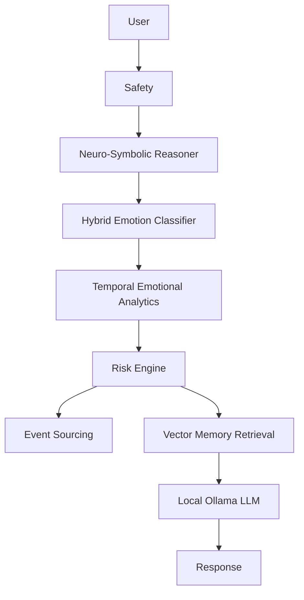

# Privacy-Preserving Neuro-Symbolic Mental Health Assistant

A FastAPI, PostgreSQL, pgvector, JWT, and Ollama backend for local-first therapeutic support. The system preserves the original privacy philosophy: **raw conversation text is never persisted**.



## Core capabilities

- Privacy engineering with pseudonymous users, derived metadata only, and optional Gaussian differential privacy (`ENABLE_DP=true`).
- Explainable AI traces for every interaction.
- Neuro-symbolic safety reasoning for crisis rules.
- Temporal analytics over emotional snapshots, moving averages, volatility, trends, and momentum.
- Safety-critical LLM bypass for critical risk.
- pgvector semantic memory over privacy-preserving summaries (`Vector(768)`).
- Event sourcing for major chat pipeline actions.

## Emotional model

The emotional vector is `[d, sh, s, a]`: depression, self-harm, suicidality, anxiety.

```text
V_next = (1 - lambda)V_current + alpha*S
M_t = V_t - V_t-1
risk = 0.40*s + 0.30*sh + 0.20*d + 0.10*a
```

## API additions

- `GET /analytics/history`
- `GET /analytics/trends`
- `GET /analytics/risk`
- `GET /analytics/explain/{id}`
- `GET /analytics/events`

## Local run

```bash
make install
make dev
```

Ollama and PostgreSQL with the `vector` extension are expected locally. The application creates tables at startup for development.

## Documentation

See `docs/architecture.md`, `docs/privacy_model.md`, `docs/event_system.md`, `docs/memory_system.md`, `docs/risk_engine.md`, and `docs/neuro_symbolic_reasoning.md`.
