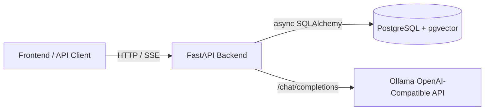
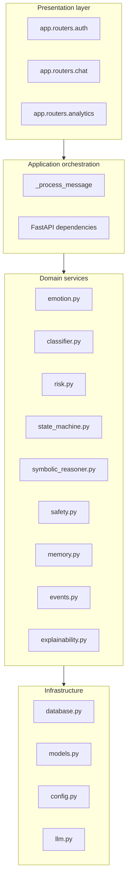
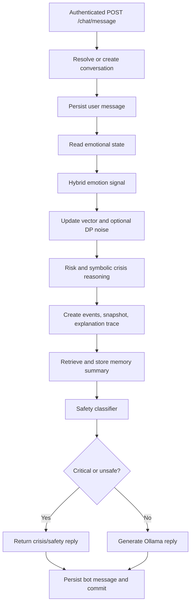
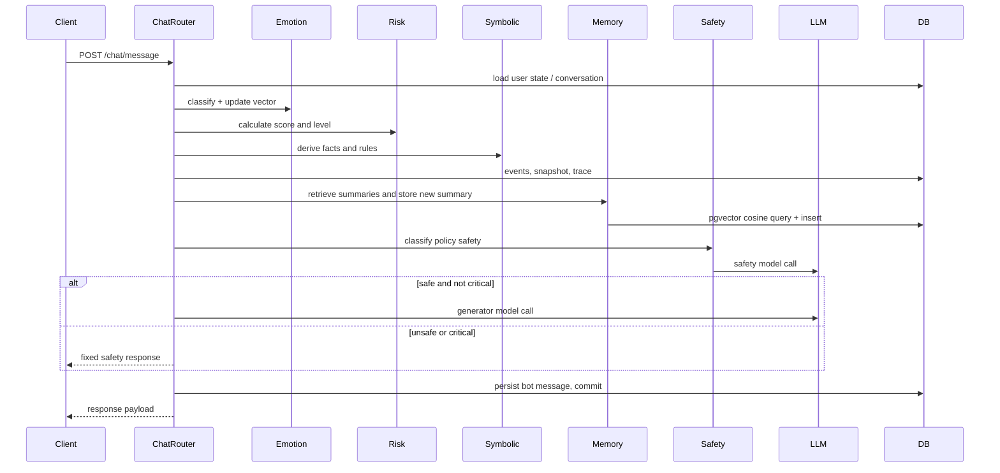

# Architecture Design Document

## Table of contents

1. [Purpose and scope](#purpose-and-scope)
2. [System context](#system-context)
3. [Layered architecture](#layered-architecture)
4. [Runtime request flow](#runtime-request-flow)
5. [Component interaction](#component-interaction)
6. [Package and module organization](#package-and-module-organization)
7. [Request lifecycle](#request-lifecycle)
8. [Current implementation and future extension](#current-implementation-and-future-extension)
9. [Related documentation](#related-documentation)

## Purpose and scope

This document describes the backend architecture of the Privacy-Preserving Neuro-Symbolic Mental Health Assistant. It focuses on runtime structure, request routing, service responsibilities, and module boundaries. It deliberately does not repeat the database schema, mathematical derivations, event catalogue, or threat analysis; those are covered in dedicated documents.

The backend is implemented as a FastAPI application with asynchronous SQLAlchemy access to PostgreSQL and pgvector. Ollama-compatible chat-completions endpoints are used for response generation and safety classification.

## System context



The system exposes authentication, chat, streaming chat, and analytics endpoints. The backend owns authentication, user state, event records, emotional snapshots, explanation traces, memory summaries, and conversation/message records.

## Layered architecture



### Layer responsibilities

| Layer                     | Responsibility                                                                                | Representative modules                                                     |
| ------------------------- | --------------------------------------------------------------------------------------------- | -------------------------------------------------------------------------- |
| Presentation              | HTTP routing, request/response validation, dependency injection                               | `app/routers/*.py`, `app/schemas.py`                                       |
| Application orchestration | Coordinates one use case across multiple services and persistence operations                  | `app/routers/chat.py::_process_message`                                    |
| Domain services           | Deterministic scoring, state transition, memory summarization, event creation, symbolic rules | `app/services/*.py`                                                        |
| Infrastructure            | Database models/session, configuration, Ollama HTTP calls                                     | `app/models.py`, `app/database.py`, `app/config.py`, `app/services/llm.py` |

## Runtime request flow



The streaming endpoint follows the same pre-generation processing, then returns an SSE stream. In the current implementation, token streaming is simulated by splitting a fully generated reply into whitespace-separated tokens.

## Component interaction

The chat router is the highest-level coordinator. It delegates to domain services rather than embedding scoring logic directly in route handlers. This keeps the route interface simple while allowing individual engines to be tested independently.



## Package and module organization

```text
app/
  main.py                 FastAPI app construction and router registration
  config.py               Environment-backed configuration
  database.py             Async engine/session and development table creation
  models.py               SQLAlchemy ORM tables, including pgvector columns
  schemas.py              Pydantic request/response models
  routers/
    auth.py               Signup, login, logout
    chat.py               Conversations, messages, chat, streaming, state
    analytics.py          History, trends, risk, explanations, events
  services/
    auth.py               JWT, password hashing, pseudonymization
    emotion.py            Keyword/sentiment signal and vector update
    classifier.py         Lightweight classifier contribution
    state_machine.py      Emotional mode selection
    risk.py               Score and level mapping
    symbolic_reasoner.py  Deterministic crisis rules
    safety.py             Ollama safety classifier wrapper
    llm.py                Ollama generator wrapper
    memory.py             Summary, embedding, retrieval
    events.py             System event creation
    explainability.py     Trace construction and persistence
    privacy.py            Optional Gaussian noise
    emotion_history.py    Snapshots, momentum, moving average, volatility, trend
```

## Request lifecycle

1. Authentication dependency decodes the bearer token and loads the current user.
2. The router validates input through Pydantic schemas or FastAPI query validation.
3. Database work is performed in an async session.
4. Domain services produce derived metadata: vectors, risk levels, symbolic conclusions, events, traces, and summaries.
5. Safety gating determines whether the generator may be called.
6. The transaction is committed after persistence operations.
7. The API returns a typed JSON response or an SSE stream.

## Current implementation and future extension

### Current Implementation

- FastAPI route modules provide authentication, chat, streaming chat, and analytics.
- PostgreSQL tables are represented in SQLAlchemy models.
- `memory_embeddings.embedding` and emotional vectors use pgvector column types.
- Conversation `messages.content` currently persists raw user and bot messages for conversation history.
- The privacy-preserving memory subsystem persists summaries rather than raw memory text.
- The streaming endpoint emits SSE but uses a full generated response split into tokens rather than provider-native streaming.

### Future Extension

- Replace raw message persistence with redacted, encrypted, expiring, or opt-in storage if the strict no-raw-text boundary is required.
- Move orchestration from the chat router into an application service to reduce route-handler complexity.
- Add background workers for event consumers, memory compaction, and analytics aggregation.
- Use provider-native streaming from Ollama when available.
