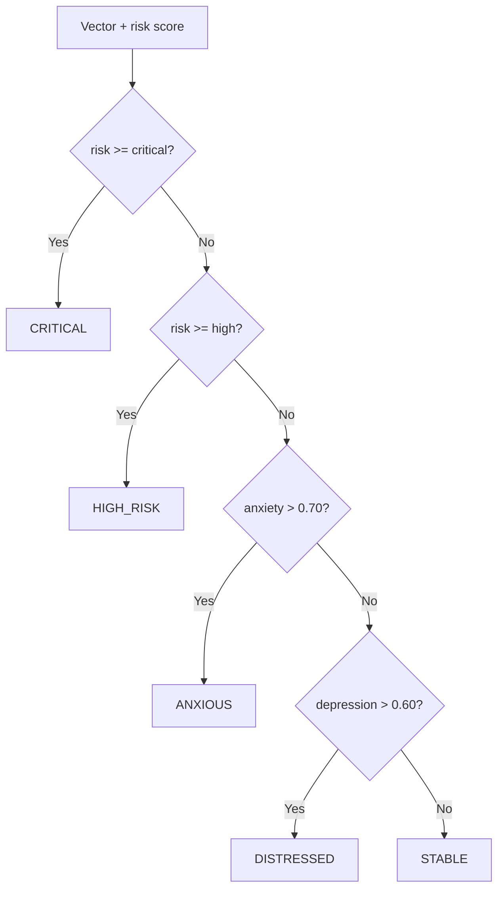

# Emotional State Engine

## Table of contents

1. [Purpose](#purpose)
2. [Emotional vector definition](#emotional-vector-definition)
3. [Update equations](#update-equations)
4. [Momentum](#momentum)
5. [Moving average](#moving-average)
6. [Volatility](#volatility)
7. [State transitions](#state-transitions)
8. [Examples](#examples)
9. [Current implementation and future extension](#current-implementation-and-future-extension)
10. [Related documentation](#related-documentation)

## Purpose

The emotional state engine maintains a compact time-varying representation of user distress used by risk, analytics, and response generation.

## Emotional vector definition

```text
V = [d, sh, s, a]
```

where `d` is depression, `sh` is self-harm, `s` is suicidality, and `a` is anxiety.

## Update equations

```text
V_next = clip((1 - lambda) * V_current + alpha * S, -1, 1)
```

`S` is the hybrid signal vector, `lambda` is decay, and `alpha` is sensitivity.

## Momentum

```text
M_t = V_t - V_{t-1}
```

Momentum highlights recent direction and magnitude of state change.

## Moving average

The analytics service computes a component-wise average over the most recent window, defaulting to 5 vectors.

## Volatility

Volatility is the standard deviation of risk scores over the most recent window, defaulting to 10 snapshots.

## State transitions



## Examples

| Vector                  |   Risk | Mode         |
| ----------------------- | -----: | ------------ |
| `[0.1, 0.0, 0.0, 0.2]`  | `0.04` | `STABLE`     |
| `[0.2, 0.0, 0.0, 0.8]`  | `0.12` | `ANXIOUS`    |
| `[0.7, 0.1, 0.0, 0.2]`  | `0.19` | `DISTRESSED` |
| `[0.8, 0.8, 0.7, 0.5]`  | `0.73` | `HIGH_RISK`  |
| `[0.8, 0.9, 0.95, 0.4]` | `0.85` | `CRITICAL`   |

## Current implementation and future extension

### Current Implementation

The update engine is deterministic except when optional privacy noise is enabled.

### Future Extension

Calibrate axis signals, separate negative and positive wellbeing axes, and add confidence intervals for analytics.

## Related documentation

- [Architecture](architecture.md) for the end-to-end backend structure.
- [Database schema](database_schema.md) for persistence details.
- [Privacy model](privacy_model.md) and [Threat model](threat_model.md) for security and privacy constraints.
- [Mathematical foundations](mathematical_foundations.md) for equations used by the engines.
