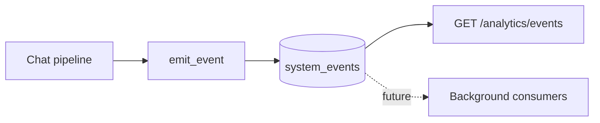
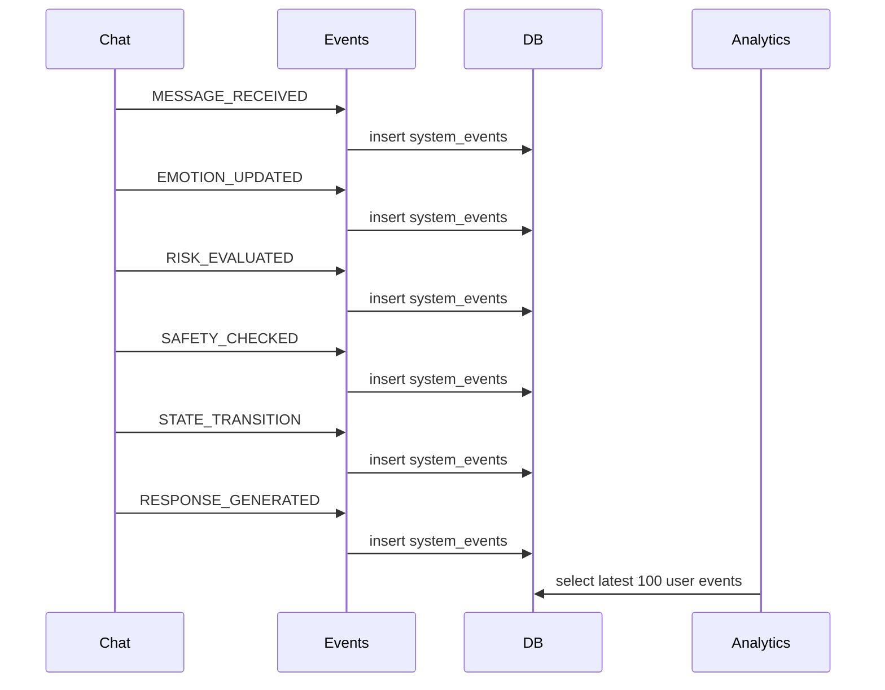

# Event System

## Table of contents

1. [Purpose](#purpose)
2. [Event-driven architecture](#event-driven-architecture)
3. [Event catalogue](#event-catalogue)
4. [Event payloads](#event-payloads)
5. [Producers](#producers)
6. [Consumers](#consumers)
7. [Event sequence](#event-sequence)
8. [Audit trail](#audit-trail)
9. [Current implementation and future extension](#current-implementation-and-future-extension)
10. [Related documentation](#related-documentation)

## Purpose

The event system records major processing milestones during chat handling. It supports auditability and analytics without requiring every consumer to be embedded directly in the request path.

## Event-driven architecture



## Event catalogue

| Event type           | Meaning                                        | Producer                         |
| -------------------- | ---------------------------------------------- | -------------------------------- |
| `MESSAGE_RECEIVED`   | A chat message entered the processing pipeline | Chat router                      |
| `EMOTION_UPDATED`    | Emotional vector changed                       | Chat router after emotion update |
| `RISK_EVALUATED`     | Risk score and level were calculated           | Chat router after risk engine    |
| `SAFETY_CHECKED`     | Policy safety classifier completed             | Chat router after safety service |
| `STATE_TRANSITION`   | Current emotional mode was determined          | Chat router                      |
| `RESPONSE_GENERATED` | Final response path selected                   | Chat router                      |

## Event payloads

Payloads are JSONB. Examples of current payload shapes:

```json
{ "conversation_content": "redacted" }
```

```json
{ "previous": [0.0, 0.0, 0.0, 0.0], "updated": [0.1, 0.0, 0.0, 0.2] }
```

```json
{
  "score": 0.43,
  "level": "MEDIUM",
  "symbolic": {
    "facts": [],
    "rules_triggered": [],
    "conclusion": "NO_CRISIS_PROTOCOL"
  }
}
```

## Producers

The current producer is the chat processing pipeline. The `emit_event` service converts NumPy scalar/array values to JSON-safe values before inserting records.

## Consumers

### Current Implementation

- `/analytics/events` returns the latest 100 events for the authenticated user.
- Explanation and trend endpoints use their own tables rather than consuming events.

### Future Extension

- Background workers could consume events to update aggregates, trigger alerts, or export audit data.
- A publish/subscribe broker could be introduced if event volume exceeds synchronous database inserts.

## Event sequence



## Audit trail

The audit trail is append-oriented at the application level: events are inserted but not updated by event code. Database constraints do not currently prevent deletion by privileged users. Each record contains `user_id`, timestamp, event type, and payload.

## Current implementation and future extension

### Current Implementation

Events are synchronous database writes within the request transaction. If the transaction is rolled back, events are rolled back too.

### Future Extension

For production audit trails, add immutable storage policies, retention rules, structured schemas per event type, and operational monitoring for event-write failures.

## Related documentation

- [Architecture](architecture.md) for the end-to-end backend structure.
- [Database schema](database_schema.md) for persistence details.
- [Privacy model](privacy_model.md) and [Threat model](threat_model.md) for security and privacy constraints.
- [Mathematical foundations](mathematical_foundations.md) for equations used by the engines.
