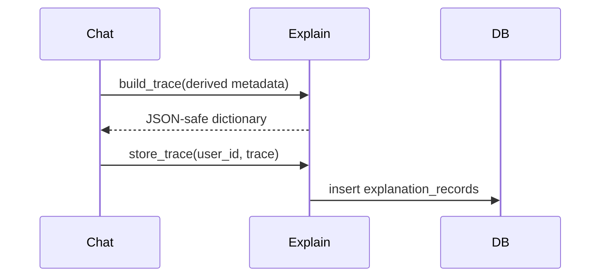

# Explainability Design

## Table of contents

1. [Purpose](#purpose)
2. [Explainability architecture](#explainability-architecture)
3. [Explanation trace schema](#explanation-trace-schema)
4. [Pipeline diagrams](#pipeline-diagrams)
5. [Field interpretation](#field-interpretation)
6. [Example explanation output](#example-explanation-output)
7. [Current implementation and future extension](#current-implementation-and-future-extension)
8. [Related documentation](#related-documentation)

## Purpose

Explainability records make the system's decisions inspectable without storing a full natural-language rationale from the model.

## Explainability architecture

```mermaid
flowchart TD
    A[Message processing] --> B[Derived metrics]
    B --> C[build_trace]
    C --> D[(explanation_records.trace JSONB)]
    D --> E[GET /analytics/explain/{id}]
```

## Explanation trace schema

Current traces are JSON dictionaries with these top-level fields: `message_analysis`, `signal_vector`, `previous_state`, `updated_state`, `momentum`, `risk_score`, `risk_level`, `state_machine_mode`, and `safety_check`.

## Pipeline diagrams



## Field interpretation

| Field                              | Meaning                                           |
| ---------------------------------- | ------------------------------------------------- |
| `message_analysis.sentiment`       | Rule-based polarity score.                        |
| `message_analysis.negativity`      | Fractional negative-phrase score.                 |
| `message_analysis.keyword_scores`  | Per-axis keyword matches for `d`, `sh`, `s`, `a`. |
| `message_analysis.classifier`      | Lightweight classifier output.                    |
| `signal_vector`                    | Hybrid signal used for emotional update.          |
| `previous_state` / `updated_state` | Emotional vector before and after processing.     |
| `momentum`                         | Component-wise change.                            |
| `risk_score` / `risk_level`        | Risk engine output.                               |
| `state_machine_mode`               | Selected emotional mode.                          |
| `safety_check`                     | Policy verdict plus symbolic reasoning output.    |

## Example explanation output

```json
{
  "message_analysis": {
    "sentiment": -0.7,
    "negativity": 0.25,
    "keyword_scores": { "d": 0.33, "sh": 0.0, "s": 0.0, "a": 0.33 }
  },
  "signal_vector": [-0.2, -0.18, -0.15, -0.08],
  "previous_state": [0.0, 0.0, 0.0, 0.0],
  "updated_state": [-0.06, -0.054, -0.045, -0.024],
  "momentum": [-0.06, -0.054, -0.045, -0.024],
  "risk_score": 0.0,
  "risk_level": "LOW",
  "state_machine_mode": "STABLE",
  "safety_check": {
    "safe": true,
    "symbolic_reasoning": {
      "facts": [],
      "rules_triggered": [],
      "conclusion": "NO_CRISIS_PROTOCOL"
    }
  }
}
```

## Current implementation and future extension

### Current Implementation

Trace construction is a direct dictionary wrapper around derived values.

### Future Extension

Add a versioned trace schema, stable trace IDs in chat responses, and UI-friendly explanations that translate numeric fields into concise user-safe statements.

## Related documentation

- [Architecture](architecture.md) for the end-to-end backend structure.
- [Database schema](database_schema.md) for persistence details.
- [Privacy model](privacy_model.md) and [Threat model](threat_model.md) for security and privacy constraints.
- [Mathematical foundations](mathematical_foundations.md) for equations used by the engines.
