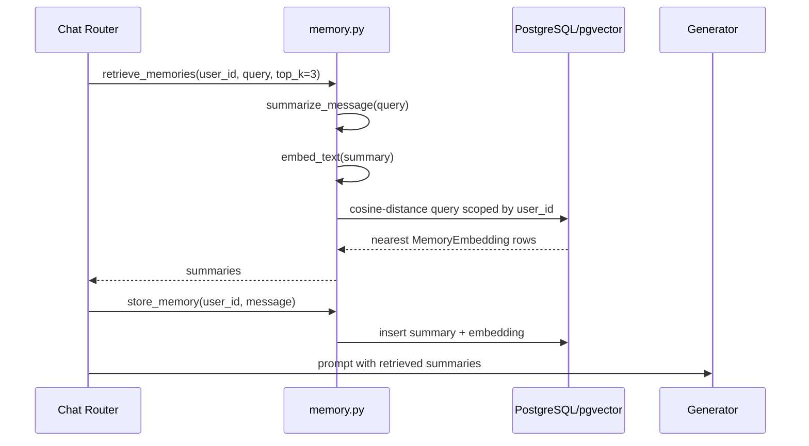

# Semantic Memory System

## Table of contents

1. [Purpose](#purpose)
2. [Semantic memory architecture](#semantic-memory-architecture)
3. [Embedding generation](#embedding-generation)
4. [pgvector storage](#pgvector-storage)
5. [Similarity search](#similarity-search)
6. [Retrieval pipeline](#retrieval-pipeline)
7. [Memory summarization](#memory-summarization)
8. [Retrieval sequence diagram](#retrieval-sequence-diagram)
9. [Current implementation and future extension](#current-implementation-and-future-extension)
10. [Related documentation](#related-documentation)

## Purpose

The memory system gives the response generator continuity without requiring long raw chat transcripts in the prompt. It stores short thematic summaries with vector embeddings and retrieves the most similar summaries for the current message.

## Semantic memory architecture

```mermaid
flowchart TD
    M[Incoming message] --> S[Rule-based summarizer]
    S --> E[Deterministic embedding]
    E --> DB[(memory_embeddings vector(768))]
    M --> QS[Query summarizer]
    QS --> QE[Query embedding]
    QE --> KNN[Cosine-distance top-k query]
    DB --> KNN
    KNN --> C[Memory context for generator]
```

## Embedding generation

### Current Implementation

`embed_text` creates a deterministic 768-dimensional vector from a SHA-256 digest repeated across dimensions and scaled to `[-1, 1]`. This satisfies the pgvector storage contract and enables deterministic tests, but it is not a true semantic embedding model.

### Future Extension

The code comments identify sentence-transformer-style embeddings as a drop-in future replacement. A production semantic memory system should use a locally hosted embedding model, normalize vectors consistently, and version embeddings when the model changes.

## pgvector storage

The `memory_embeddings` table contains:

- `user_id`: owner boundary for retrieval.
- `embedding`: `Vector(768)` field queried with cosine distance.
- `summary`: bounded text summary up to 500 characters.
- `created_at`: insertion timestamp.

See [Database schema](database_schema.md) for table-level detail.

## Similarity search

Retrieval computes a query embedding from the summary of the new message, filters rows by `user_id`, orders by cosine distance, and limits to `top_k` records. The current default `top_k` is 3 in the chat pipeline.

```text
ORDER BY memory_embeddings.embedding <=> query_embedding
LIMIT top_k
```

## Retrieval pipeline

1. Summarize current user message into a thematic category.
2. Embed the current summary.
3. Query pgvector for nearest user-owned memory rows.
4. Extract summaries from returned rows.
5. Store a new memory summary for the current message.
6. Pass retrieved summaries to the generator prompt if the request is safe and non-critical.

## Memory summarization

The summarizer is intentionally conservative and rule-based. It maps keywords such as interview, sleep, school, panic, anxious, sad, and hopeless to broad themes. This reduces raw-text exposure but also loses nuance.

## Retrieval sequence diagram



## Current implementation and future extension

### Current Implementation

- Per-user memory isolation is enforced in retrieval queries.
- Summaries, not raw memory messages, are stored in `memory_embeddings`.
- Embeddings are deterministic hash-derived vectors.

### Future Extension

- Add approximate nearest-neighbor indexes such as HNSW or IVFFlat after measuring dataset size.
- Add memory deduplication and periodic summarization/compaction.
- Introduce embedding model metadata to support re-embedding migrations.

## Related documentation

- [Architecture](architecture.md) for the end-to-end backend structure.
- [Database schema](database_schema.md) for persistence details.
- [Privacy model](privacy_model.md) and [Threat model](threat_model.md) for security and privacy constraints.
- [Mathematical foundations](mathematical_foundations.md) for equations used by the engines.
