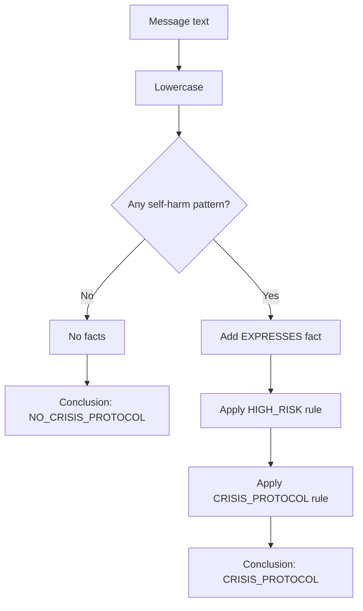
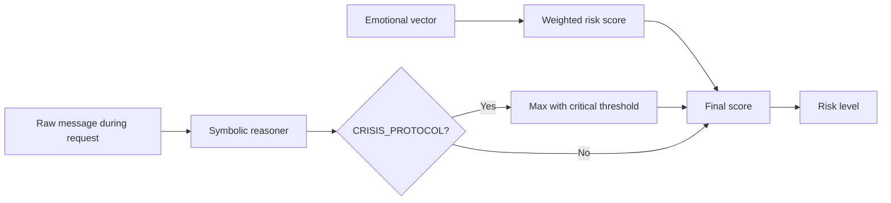

# Neuro-Symbolic Reasoning

## Table of contents

1. [Purpose](#purpose)
2. [Facts](#facts)
3. [Rules](#rules)
4. [Inference engine](#inference-engine)
5. [Rule execution](#rule-execution)
6. [Example reasoning chains](#example-reasoning-chains)
7. [Integration with the risk engine](#integration-with-the-risk-engine)
8. [Mermaid flowcharts](#mermaid-flowcharts)
9. [Current implementation and future extension](#current-implementation-and-future-extension)
10. [Related documentation](#related-documentation)

## Purpose

The neuro-symbolic layer combines numerical emotional scoring with explicit rules. The neural/statistical side estimates emotional dimensions; the symbolic side detects crisis-language patterns that require deterministic safety behavior.

## Facts

A fact is a structured assertion derived from a message. The current fact vocabulary is intentionally small:

| Fact                               | Meaning                                                                  |
| ---------------------------------- | ------------------------------------------------------------------------ |
| `EXPRESSES(user,self_harm_intent)` | Message contains one of the configured self-harm or suicidality patterns |

## Rules

Current rules are represented as strings in the explanation output:

```text
EXPRESSES(x,self_harm_intent) -> HIGH_RISK(x)
HIGH_RISK(x) -> CRISIS_PROTOCOL(x)
```

These rules encode precedence: explicit self-harm intent is sufficient to activate the crisis protocol regardless of the weighted numerical score.

## Inference engine

The inference engine is deterministic pattern matching over lower-cased text. It checks for phrases such as `kill myself`, `suicide`, `end it`, `want to disappear`, `not exist`, and `hurt myself`.

## Rule execution



## Example reasoning chains

### Non-crisis message

Input theme: exam anxiety.

1. No configured self-harm pattern is found.
2. Facts list remains empty.
3. No rules are triggered.
4. Conclusion is `NO_CRISIS_PROTOCOL`.
5. Risk is determined only by the emotional vector score.

### Crisis-language message

Input theme: explicit self-harm intent.

1. Pattern matcher derives `EXPRESSES(user,self_harm_intent)`.
2. Rule 1 derives high-risk status.
3. Rule 2 derives `CRISIS_PROTOCOL`.
4. The chat pipeline raises the risk score to the critical threshold if necessary.
5. The generator is bypassed and the fixed safety reply is returned.

## Integration with the risk engine



## Mermaid flowcharts

The central design principle is that symbolic rules act as a safety override rather than a replacement for continuous emotional scoring. This makes the behavior inspectable: reviewers can trace exactly why a crisis response was selected.

## Current implementation and future extension

### Current Implementation

- The symbolic reasoner uses a small phrase list and returns facts, triggered rules, and a conclusion.
- It is integrated into chat processing and explanation traces.

### Future Extension

- Replace string rules with a typed rule representation.
- Add negation handling, confidence annotations, and rule tests.
- Add domain-reviewable rule configuration outside source code.

## Related documentation

- [Architecture](architecture.md) for the end-to-end backend structure.
- [Database schema](database_schema.md) for persistence details.
- [Privacy model](privacy_model.md) and [Threat model](threat_model.md) for security and privacy constraints.
- [Mathematical foundations](mathematical_foundations.md) for equations used by the engines.
