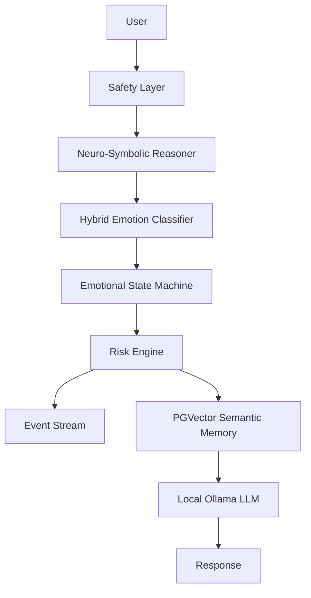

# neuro symbolic reasoning

This backend is evolved into a Privacy-Preserving Neuro-Symbolic Mental Health Assistant while preserving the no-raw-conversation-persistence boundary.

## Privacy invariant
Raw messages are used transiently for local inference, safety checks, symbolic reasoning, and summary generation. Persistent tables store only vectors, summaries, event metadata, and explanation metadata.

## Mathematical core
Emotional update: `V_next = (1 - lambda)V_current + alpha*S`.
Risk: `0.40*suicidality + 0.30*self_harm + 0.20*depression + 0.10*anxiety`.
Momentum: `M_t = V_t - V_{t-1}`.
