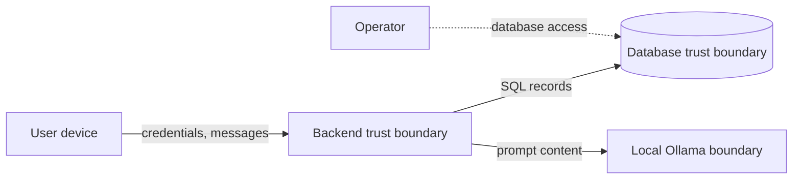
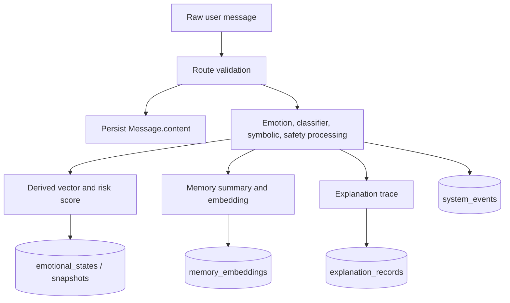

# Privacy Model

## Table of contents

1. [Purpose](#purpose)
2. [Trust boundaries](#trust-boundaries)
3. [Data classification](#data-classification)
4. [Privacy guarantees](#privacy-guarantees)
5. [Data lifecycle](#data-lifecycle)
6. [Persistent vs transient data](#persistent-vs-transient-data)
7. [Pseudonymization](#pseudonymization)
8. [Differential privacy](#differential-privacy)
9. [Threat analysis](#threat-analysis)
10. [Current implementation and future extension](#current-implementation-and-future-extension)
11. [Related documentation](#related-documentation)

## Purpose

This document defines privacy boundaries for the backend. It separates implemented guarantees from intended privacy-preserving design goals so that reviewers can evaluate the system honestly.

## Trust boundaries



The backend is trusted to process raw input during a request. PostgreSQL is trusted to store application records. Ollama is expected to be locally operated; if it is replaced with a remote endpoint, the privacy boundary changes materially.

## Data classification

| Class                   | Examples                                        | Sensitivity | Storage status                                         |
| ----------------------- | ----------------------------------------------- | ----------: | ------------------------------------------------------ |
| Account identifiers     | email, password hash, UUID                      |        High | Persistent                                             |
| Pseudonymous identifier | HMAC-derived pseudonym                          |      Medium | Persistent                                             |
| Raw conversation text   | `messages.content`, prompt sent to Ollama       |   Very high | Persistent in `messages`; transient in inference calls |
| Derived state           | emotional vectors, risk score, mode             |        High | Persistent                                             |
| Memory summaries        | thematic summaries                              | Medium/high | Persistent                                             |
| Event metadata          | event type and JSON payload                     | Medium/high | Persistent                                             |
| Explanation traces      | classifier scores, state updates, safety result |        High | Persistent                                             |

## Privacy guarantees

### Current Implementation

- Passwords are hashed before storage.
- Users have pseudonym identifiers separate from email addresses.
- Memory records store bounded summaries and embeddings rather than the original message text.
- Event payload for `MESSAGE_RECEIVED` redacts content.
- Optional Gaussian noise can be applied to emotional vectors before persistence.

### Not currently guaranteed

- Raw chat text is not eliminated from persistence because `messages.content` stores conversation history.
- Database-level encryption, field-level encryption, retention deletion, and key rotation are not implemented in the repository.
- The optional Gaussian mechanism is not a complete formal differential privacy system without privacy-budget accounting.

## Data lifecycle



## Persistent vs transient data

| Data item          | Transient use                                                                 | Persistent record                                                      |
| ------------------ | ----------------------------------------------------------------------------- | ---------------------------------------------------------------------- |
| User message       | classifier, symbolic rules, memory summarizer, safety model, generator prompt | `messages.content` and derived tables                                  |
| Bot reply          | API response                                                                  | `messages.content`                                                     |
| Emotional vector   | risk/state calculation                                                        | `emotional_states.vector`, `emotional_snapshots.vector`                |
| Safety verdict     | response gating                                                               | `system_events.payload`, explanation trace                             |
| Retrieved memories | generator context                                                             | Existing memory rows remain; retrieval result is not separately stored |

## Pseudonymization

The authentication service derives a pseudonym from the user UUID using an HMAC key. Pseudonymization reduces direct exposure of email addresses in contexts that can use pseudonymous IDs, but it is not anonymization because the application database still contains the mapping between user, email, and pseudonym.

## Differential privacy

The implemented mechanism is Gaussian noise applied independently to vector components:

```text
x' = clip(x + N(0, sigma^2), -1, 1)
```

It is disabled by default. When enabled, it reduces precision of stored emotional vectors but may affect user experience, risk calculation, and reproducibility. It should be treated as a differential-privacy-style perturbation rather than a complete DP guarantee unless privacy budgets, adjacency definitions, and composition accounting are added.

## Threat analysis

| Threat                 | Privacy impact                              | Current mitigation                                 | Gap                                     |
| ---------------------- | ------------------------------------------- | -------------------------------------------------- | --------------------------------------- |
| Database disclosure    | Exposure of emails, messages, derived state | Password hashing; pseudonyms; summary-based memory | Raw messages remain sensitive           |
| Operator misuse        | Insider access to sensitive records         | No special controls in code                        | Need least privilege and audit policies |
| Remote LLM endpoint    | Raw prompt disclosure outside local host    | Defaults to local Ollama URL                       | Must document deployment boundary       |
| Linkage attack         | Connecting pseudonym to email               | Pseudonym is separate from email                   | Mapping remains in `users`              |
| Inference from vectors | Sensitive mental state leakage              | Optional noise                                     | DP accounting absent                    |

## Current implementation and future extension

### Current Implementation

Privacy is strongest in the memory and event subsystems, where raw message content is summarized or redacted. It is weaker in conversation history, which stores raw message content for retrieval by `/chat/{conversation_id}/messages`.

### Future Extension

- Add configurable retention and deletion for raw messages.
- Encrypt `messages.content` or replace it with summaries/redacted text.
- Store privacy-budget metadata if DP is enabled.
- Separate account identity from analytics tables through a stricter pseudonymous key strategy.

## Related documentation

- [Architecture](architecture.md) for the end-to-end backend structure.
- [Database schema](database_schema.md) for persistence details.
- [Privacy model](privacy_model.md) and [Threat model](threat_model.md) for security and privacy constraints.
- [Mathematical foundations](mathematical_foundations.md) for equations used by the engines.
