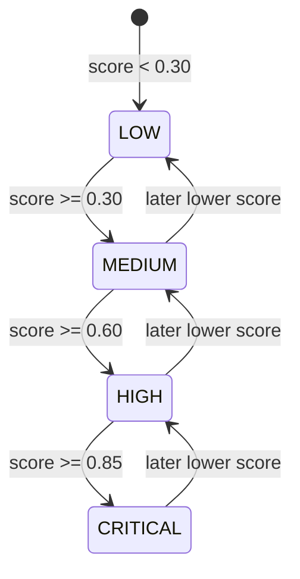

# Risk Engine

## Table of contents

1. [Purpose](#purpose)
2. [Risk calculation formula](#risk-calculation-formula)
3. [Threshold selection](#threshold-selection)
4. [Risk levels](#risk-levels)
5. [Crisis protocol](#crisis-protocol)
6. [Decision flow](#decision-flow)
7. [Worked examples](#worked-examples)
8. [Mathematical justification](#mathematical-justification)
9. [Current implementation and future extension](#current-implementation-and-future-extension)
10. [Related documentation](#related-documentation)

## Purpose

The risk engine maps a four-dimensional emotional vector to a normalized risk score and discrete risk level. It is deterministic, lightweight, and easy to inspect during a viva.

## Risk calculation formula

The vector ordering is:

```text
V = [depression, self_harm, suicidality, anxiety]
```

The score is:

```text
risk = clip(0.20*d + 0.30*sh + 0.40*s + 0.10*a, 0, 1)
```

Suicidality receives the highest weight, self-harm the second highest, depression the third, and anxiety the lowest. The implementation rounds the clipped score to six decimal places.

## Threshold selection

|       Threshold | Level    | Rationale                                                 |
| --------------: | -------- | --------------------------------------------------------- |
|        `< 0.30` | LOW      | No dominant high-risk dimensions in weighted sum          |
| `0.30–0.599999` | MEDIUM   | Meaningful distress requiring careful supportive response |
| `0.60–0.849999` | HIGH     | Elevated risk; state machine enters high-risk mode        |
|       `>= 0.85` | CRITICAL | Safety-first behavior and crisis protocol                 |

Application settings include configurable high and critical thresholds for state-machine decisions, while `risk_level` currently uses fixed thresholds.

## Risk levels



## Crisis protocol

The symbolic reasoner can force a critical score when crisis language is detected. If the symbolic conclusion is `CRISIS_PROTOCOL`, the chat pipeline sets the score to at least the configured critical threshold. If the final level is critical, the generator is bypassed and a fixed safety reply is returned.

## Decision flow

```mermaid
flowchart TD
    A[Updated emotional vector] --> B[Weighted risk score]
    B --> C[Symbolic crisis conclusion?]
    C -->|Yes| D[score = max(score, critical threshold)]
    C -->|No| E[keep score]
    D --> F[Map to risk level]
    E --> F
    F --> G{Critical?}
    G -->|Yes| H[Bypass generator]
    G -->|No| I[Allow safety-gated generation]
```

## Worked examples

| Vector `[d, sh, s, a]`  | Calculation                 |  Score | Level    |
| ----------------------- | --------------------------- | -----: | -------- |
| `[0.1, 0.0, 0.0, 0.2]`  | `0.02 + 0 + 0 + 0.02`       | `0.04` | LOW      |
| `[0.6, 0.2, 0.0, 0.7]`  | `0.12 + 0.06 + 0 + 0.07`    | `0.25` | LOW      |
| `[0.7, 0.5, 0.2, 0.6]`  | `0.14 + 0.15 + 0.08 + 0.06` | `0.43` | MEDIUM   |
| `[0.8, 0.8, 0.7, 0.5]`  | `0.16 + 0.24 + 0.28 + 0.05` | `0.73` | HIGH     |
| `[0.8, 0.9, 0.95, 0.4]` | `0.16 + 0.27 + 0.38 + 0.04` | `0.85` | CRITICAL |

## Mathematical justification

The formula is a convex weighted sum when vector dimensions are in `[0, 1]` and weights sum to 1. This preserves interpretability: each dimension contributes a known maximum share to the final score. Clipping protects downstream decision logic if upstream vector values fall outside the expected range.

## Current implementation and future extension

### Current Implementation

- Weighted-sum risk scoring is implemented in `app/services/risk.py`.
- Discrete risk levels are deterministic.
- Symbolic crisis reasoning can raise the score to the critical threshold.

### Future Extension

- Calibrate weights and thresholds using evaluated datasets and clinical review.
- Add test fixtures for edge cases exactly at thresholds.
- Separate clinical risk from content-policy safety to avoid conflating distinct decisions.

## Related documentation

- [Architecture](architecture.md) for the end-to-end backend structure.
- [Database schema](database_schema.md) for persistence details.
- [Privacy model](privacy_model.md) and [Threat model](threat_model.md) for security and privacy constraints.
- [Mathematical foundations](mathematical_foundations.md) for equations used by the engines.
