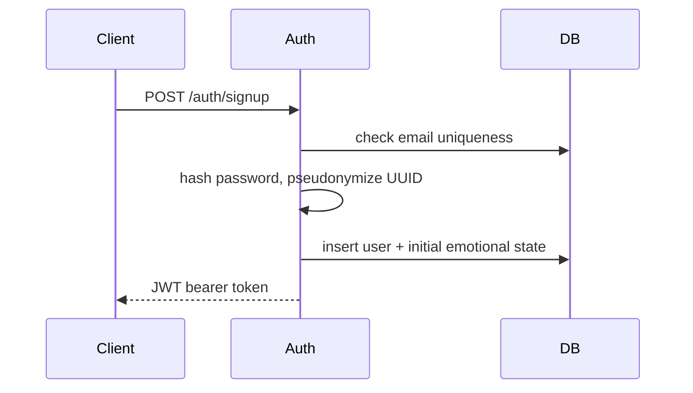
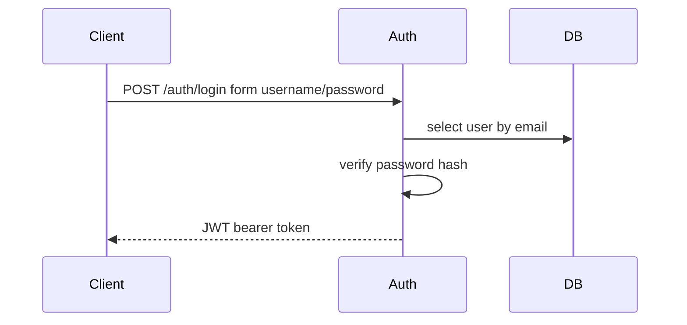
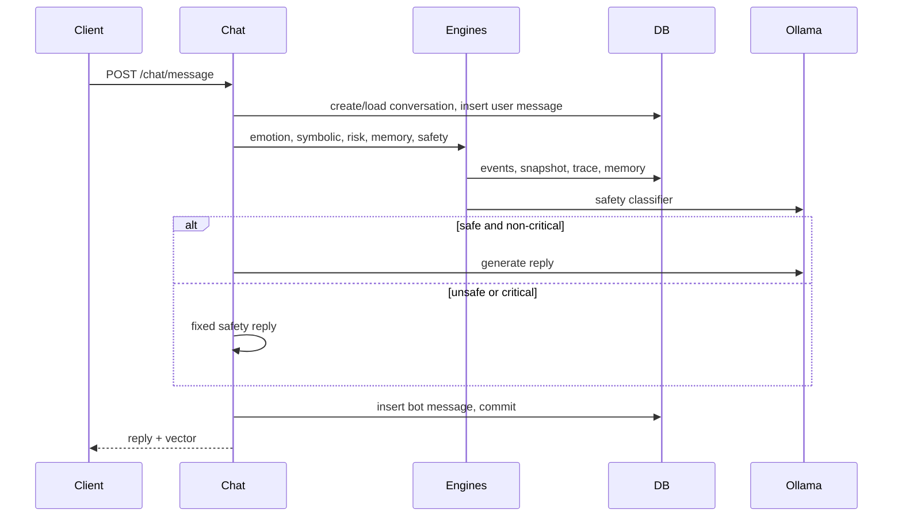
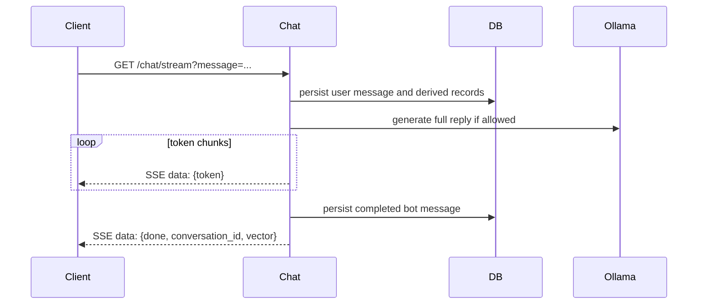
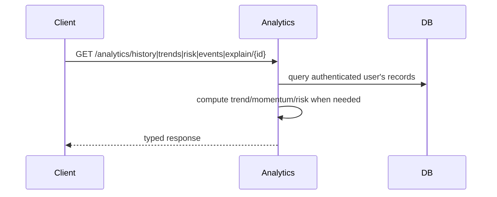

# API Sequence Diagrams

## Table of contents

1. [Purpose](#purpose)
2. [Signup sequence](#signup-sequence)
3. [Login sequence](#login-sequence)
4. [Chat message flow](#chat-message-flow)
5. [Streaming response flow](#streaming-response-flow)
6. [Analytics endpoint flow](#analytics-endpoint-flow)
7. [Related documentation](#related-documentation)

## Purpose

This document centralizes endpoint interaction diagrams. Architectural rationale is kept in [Architecture](architecture.md).

## Signup sequence

## Login sequence

## Chat message flow

## Streaming response flow

## Analytics endpoint flow

## Related documentation

- [Architecture](architecture.md) for the end-to-end backend structure.
- [Database schema](database_schema.md) for persistence details.
- [Privacy model](privacy_model.md) and [Threat model](threat_model.md) for security and privacy constraints.
- [Mathematical foundations](mathematical_foundations.md) for equations used by the engines.
